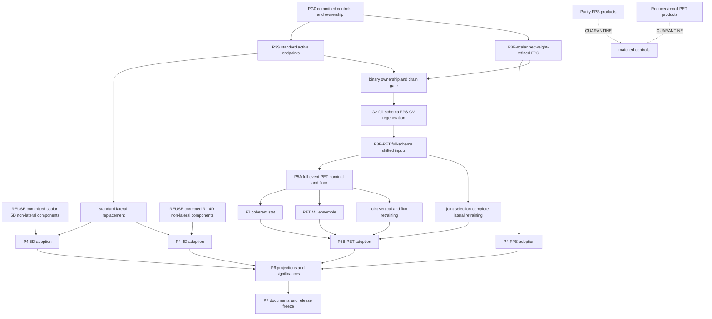

# Result dependency and rerun map

**Routing instructions only.** This file defines dependency and invalidation
rules; it does not record current completion. Live work belongs in
`OPEN_ITEMS.md` and dimensional STATUS files, verified numbers in
`../VALIDATION_LEDGER.md`, bugs in `../KNOWN_ISSUES.md`, and chronology in the
RUN_LOGs.

## Node vocabulary

| Mark | Meaning |
|---|---|
| `REUSE` | Consume only after its commit, summary, content fingerprint, and estimator contract validate. |
| `BUILD` | A new node is required in a distinct namespace. |
| `REPLACE` | Swap only the named component; prove all other component hashes are unchanged. |
| `QUARANTINE` | Preserve as a labeled control/cross-check; never feed a publication descendant. |
| `GATED` | No launch until all named upstream commits and validators pass. |

No filesystem artifact is implicitly `REUSE`. Size-only existence checks never
establish completion.

## Dependency graph



## Estimator identities and allowed parents

| Publication node | Required identity | Allowed parents | Forbidden parents |
|---|---|---|---|
| Scalar 5D covariance | Standard scalar central/mask/order and validated component contract | Committed corrected non-lateral components plus P3S lateral replacement | Purity-footed FPS, support-limited old lateral, mismatched masks/seeds |
| Independent 4D covariance | Corrected R1 4D central/mask/order | Reuse R1 non-lateral components; replace only lateral from P3S | Rerun corrected throws without a new invalidation; silent 5D relabel |
| Scalar FPS covariance | Explicit `negweight-refined`, extended FPS edges, mode-stamped manifest | P3F-scalar central/components only | Purity central/components; standard-phase-space endpoints |
| Publication PET | `pet-fullevent-fps-v1`, literal negative background clouds plus Stay-Positive | G2 CV, P5A, F7, joint systematics, P3F-PET | `pet-reduced-fps-cross`, recoil-only products, purity target, P3S endpoints |
| Legacy recoil PET | Legacy recoil fingerprint | Its own completed or optional legacy-only replicas | Any publication full-event descendant |

## Scalar 5D and corrected 4D routes

```text
REUSE validated scalar 5D central + corrected non-lateral components
  + BUILD P3S selection-complete standard endpoints
  -> REPLACE standard lateral only
  -> ADOPT final scalar 5D covariance
  -> PROJECT lower-dimensional covariances and significances

REUSE corrected R1 independent-4D central + non-lateral components
  + REUSE the validated P3S-derived lateral replacement
  -> REPLACE lateral only
  -> ADOPT independent 4D covariance
```

The R1 4D throws and other corrected non-lateral components remain reusable
unless their own code/config/input contract changes. A selection-complete
lateral change does not authorize rerunning them. Publication may instead use
the exact 5D-to-4D marginal, but it must label the independent 4D estimator as a
cross-check in that case.

## Scalar FPS route

```text
VALIDATE reusable FPS event-loop/universe inputs
  -> BUILD explicit negweight-refined central and endpoint unfolds
     in a mode-stamped atomic namespace
  -> BUILD/VALIDATE compatible statistical, ML, vertical, joint-throw,
     and selection-complete lateral components
  -> ADOPT scalar FPS covariance
```

All existing purity-footed unfolds, central values, and covariances are
`QUARANTINE` matched controls. Reusing an underlying ROOT input requires proof
that it contains the background and universe information needed to construct
the `negweight-refined` target; it never permits reuse of the purity unfold.

## Publication PET route

```text
PG0 controls committed
  -> binary-owner drain gate
  -> G2 full-schema FPS CV ROOT/NPZ with data, signal, truth, and background
     clouds/scalars/keys/weights
  -> freeze pet-fullevent-fps-v1 fingerprint
  -> BUILD/COMMIT P3F-PET full-schema shifted source inventory
  -> BUILD literal signed data+background target and Stay-Positive refinement
  -> BUILD nominal + GPU floor
  -> BUILD F7 coherent C_stat over full data/signal/background inventories
  + BUILD PET C_ML with no Poisson variation
  + BUILD joint physical-variation-plus-retraining vertical/flux components
  + BUILD joint P3F-PET endpoint refinement/retraining/extraction
  -> ADOPT one PET covariance on one central/mask/order/fingerprint
  -> PROJECT/report acceptance-supported and prior-dominated tiers
```

G2 precedes both the nominal and fresh full-schema P3F-PET. Reduced P3F or
recoil-only `xps2` artifacts cannot be promoted by changing a label. The exact
five-band by two-endpoint by twelve-playlist P3F-PET source inventory, joins,
migration census, hashes, schema proof, and commit receipt must pass before the
publication nominal starts; only endpoint retraining/extraction follows it.

For every PET nuisance that can change the learned mapping,

```text
delta_u = x_u(varied physical input + retrained estimator) - x_CV
```

and the component is built directly from the declared set of joint shifts. Do
not form a separate additive frozen-map covariance plus retraining covariance
for the same nuisance. Per-universe background target construction repeats the
literal negative injection and Stay-Positive refinement on that universe.

## F7 coherent statistical route

For each replica `r`:

1. Enumerate the full ordered data, signal-MC, and background-MC inventories.
2. Draw and persist coherent Poisson factors before any training subset. Each
   replica executes as an independent single-rank job; Horovod/distributed rank
   slicing is prohibited.
3. Apply data factors to data events, signal factors wherever signal MC enters,
   and background factors to the negative background injection.
4. Run the replica-specific Stay-Positive refinement after those factors.
5. Select the training subset without redrawing or reindexing the global
   factors.
6. Reuse the exact applicable MC/background factors at extraction and prove
   row/key identity.

The nominal refined target is not a replica input. Missing inventory members,
duplicate keys, seed/factor mismatch, or incomplete extraction fail the whole
replica manifest.

## Trigger-to-invalidation rules

| Trigger | Earliest restart | Invalidated descendants | Explicitly unaffected |
|---|---|---|---|
| P3S standard endpoints change | Standard lateral merge | P4-5D/P4-4D lateral and their adoptions/projections | Frozen central and validated non-lateral components |
| Scalar FPS background mode or target changes | P3F-scalar unfold | Scalar FPS central, compatible UQ, adoption, comparisons | Standard scalar chain; legacy recoil PET |
| G2 feature/schema/input changes | G2 CV/interface validation | P5A, P3F-PET, all P5B components and projections | Scalar results; legacy recoil PET |
| PET estimator fingerprint changes | P5A nominal | Floor and all PET UQ/descendants | Scalar results and quarantined cross-checks |
| F7 inventory/draw contract changes | First affected replica | `C_stat`, PET total, PET projections/comparisons | P5A nominal/floor and non-stat components |
| PET nuisance implementation changes | First affected joint universe | Its component, PET total, dependent projections | Other independently owned components after hash proof |
| Projection/bin-volume mapping changes | Projection validator | Projected covariance and derived significances | Upstream adopted covariance |
| Summary/ledger/RUN_LOG/STATUS missing | Provenance commit | Quote/citation status only | Heavy artifact; do not rerun physics |

## Reuse and atomic-skip proof

Every `REUSE` or skip record contains:

- source commit and launcher/config identity;
- exact expected unit inventory and content-level validator result;
- input/output hashes or stable ROOT-content fingerprints;
- estimator, background mode, phase-space edges, mask/order, and seed policy;
- scheduler/job receipt where applicable; and
- proof the artifact is not a partial temporary file.

Every producer writes to a unique temporary path, validates it, then atomically
renames. An interrupted partial is quarantined and regenerated; a nonzero file
size is never a completion test.

## Adoption proof

Final 5D, 4D, scalar FPS, and PET are separate adoption packets. Each packet
must prove common central/mask/order/fingerprint, exact component inventory and
block reconstruction, non-mutation of reused components, symmetry, PSD/eigen
diagnostics, finite diagonal, projection consistency, and canonical commit
evidence. P6 and publication documents depend on these adoption commits, not on
loose component files.

The executable packet contract is in
[the publication completion runbook](PUBLICATION_COMPLETION_RUNBOOK.md).
