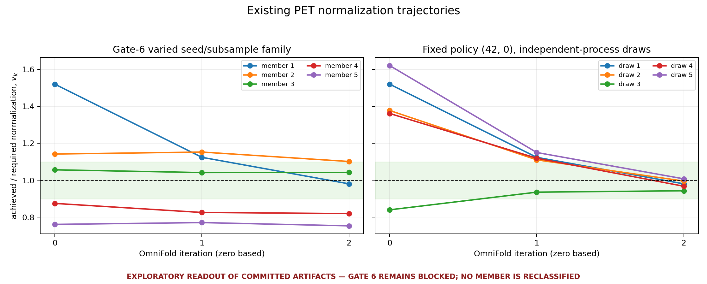
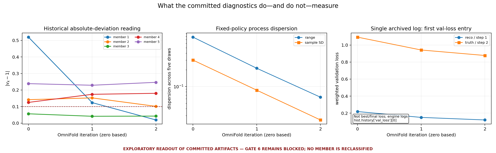

# PET Gate-6 method-development strategy — 2026-08-25

## Scope and answer

This is a **PET diagnostic and method-development strategy**, not a publication uncertainty,
central-value, or adoption proposal. The existing Gate-6 family remains
`BLOCK_GATE6_ML_ENSEMBLE` under its original rule regardless of every plot and interpretation in
this document. Nothing here reclassifies a member or loosens the old gate.

For future method development, strict step-by-step monotonicity plus a final ten-percent scalar
normalization band is **not the most informative convergence criterion**. It is a useful global
normalization guard, but:

1. zero-tolerance monotonicity penalizes stationary optimization noise;
2. the `0.10` came from an iteration-0 diagnostic-label branch in
   [`step1_increment_trajectory.py`](../../nd-unfolding/pet/step1_increment_trajectory.py), not a
   final-iteration tolerance calibrated against closure or a process floor; and
3. one global mean cannot establish local fold-forward agreement, classifier optimization,
   event-weight stationarity, calibration, or usable effective sample size.

The recommended *prospective* criterion is therefore a vector of measurements: optimization
adequacy for each reco/truth fit; stationarity of per-event log-weight increments; held-out
fold-forward response/calibration; effective sample size and cap occupancy; and global
normalization as a guard. Tolerances should be calibrated before a new family from fixed-policy
replicates and injected closure, rather than inferred from the five old members. That proposal
changes no historical verdict.

## Control-plane observation and evidence boundary

- The required live-state freshness check was run first. The repository generator reported
  `STALE :: Git: 06efa653, HEAD e428a645, HEAD^ 415d056b`; no field from the stale generated view is
  used as evidence here.
- Direct scheduler checks were attempted. `squeue` timed out without a result and `sacct` could not
  connect to `slurmdbd_service.local:6819`. Scheduler state is therefore **not asserted**. Historical
  job accounting below comes only from committed terminal receipts.
- The governing work queue and exact `OI-123`, `OI-125`, and `OI-138` rows in
  [`CURRENT_WORK.md`](../CURRENT_WORK.md) and [`OPEN_ITEMS.md`](../OPEN_ITEMS.md) were read directly,
  along with [`ND_OMNIFOLD_STATUS.md`](../../nd-unfolding/ND_OMNIFOLD_STATUS.md),
  [`PET_UQ_REMEDIATION_STATUS.md`](../../nd-unfolding/PET_UQ_REMEDIATION_STATUS.md), the
  [Gate-6 predeclaration](PREDECLARATION-20260813-gate6-member-trajectories.md), and the exact
  [member receipt](state/gate6-member-trajectories-result-56847059.json).
- Peer Mesh was requested as an optional context check, but its callable MCP tools were not exposed
  in this session. No claim below rests on worker agreement or relayed evidence.

These exact receipt prohibitions remain live:

```text
do_not_select_passing_subset
do_not_construct_C_ML
do_not_move_central
do_not_start_leg_2
do_not_retry_unchanged
```

No Slurm job, `srun`, GPU training, note edit, publication change, or primary-checkout operation was
performed for this strategy.

## Existing evidence, replotted without a new verdict





The deterministic renderer is
[`plot_pet_gate6_strategy_evidence.py`](plot_pet_gate6_strategy_evidence.py). It refuses to render if
the exact prohibitions, blocked family verdict, or non-licensing floor verdict change.

### Varied seed/subsample family

The first artifact is the committed Gate-6 result for array `56847059`; all five trajectory-readout
jobs completed in 13:44–14:00, but the family verdict is blocked.

| member `(estimator, subsample)` | `v[0], v[1], v[2]` | old receipt result | diagnostic observation only |
|---|---|---|---|
| 1 `(42,0)` | `1.519482, 1.124001, 0.980690` | PASS | Large directed movement; not evidence that a subset may be selected. |
| 2 `(43,1)` | `1.141819, 1.152498, 1.101483` | FAIL | Final band excess is only `0.001483`, but the tier-clean 0→1 rise also fails strict monotonicity. |
| 3 `(44,2)` | `1.056478, 1.041552, 1.042650` | FAIL | Final is inside the band; the `0.001098` rise crosses best-epoch to final-checkpoint tiers. |
| 4 `(45,3)` | `0.874795, 0.825847, 0.819792` | FAIL | Moves farther below one and ends outside the band. |
| 5 `(46,4)` | `0.761441, 0.771129, 0.753477` | FAIL | Ends far below one and is non-monotonic. |

At iteration 2, the varied-family range is `0.348006`, sample SD `0.147910`, and mean `0.939618`.
Those are scalar normalization measurements, not an ML covariance or an estimator uncertainty.

### Fixed-policy process floor

The independent-process control keeps `(42,0)`, `niter=3`, `epochs=8`, batch 512, and two million
events fixed. Its five final deviations are
`0.019310, 0.004480, 0.056880, 0.032366, 0.007650`; their median is `0.019310` and maximum is
`0.056880`. Across iterations, the process range contracts `0.780014 → 0.214470 → 0.064529` and the
sample SD contracts `0.300985 → 0.086361 → 0.025065`.

The controlling [floor receipt](state/gate6-floor-replication-result-56863958.json) calls this
`FLOOR_INTERMEDIATE`: neither its seed-determined nor process-determined branch fires, and no outcome
could have unblocked Gate 6. The contraction is interesting method-development evidence; it does not
license reinterpretation of the old family.

### What diagnostics exist

| diagnostic | committed availability | what can be concluded |
|---|---|---|
| all-member global trajectories | yes, three scalar points each | normalization path and old gate operands only |
| fixed-policy process trajectories | yes, five draws × three scalar points | process dispersion of the same scalar under one policy |
| full loss histories by member and fit | no tracked Gate-6 `.pkl` histories located | no claim about best epoch, overfit, or optimization plateau by member |
| archived loss text | one distinct preserved log, six values | only `hist.history['val_loss'][0]`, despite its `Last val loss` label; not best/final loss and not a five-member survey |
| per-event iteration weights/increments | not present in the routed summary artifacts | no event-weight stationarity or tail claim |
| held-out response/calibration curves | not present | global normalization cannot substitute for local response |
| ESS, cap occupancy, tail quantiles | not present | no weight-degeneracy diagnosis |

The archived log records 13,048 reco and 7,812 truth training steps and first validation-loss entries
that decrease with iteration (`0.2188 → 0.1200` reco; `1.0932 → 0.8775` truth). This is compatible
with continued learning, but it cannot distinguish adequate optimization from undertraining because
the full histories and best/final epochs are absent. Its single-copy provenance is documented in the
[retired-worktree archive record](runs/retired-worktree-archive-20260824/PROVENANCE.md).

## Hypothesis matrix

| hypothesis | supporting existing evidence | counterevidence or gap | next discriminating measurement | present status |
|---|---|---|---|---|
| H1. The zero-tolerance monotonic clause is a poor stationarity test. | Member 3 changes by only `+0.001098`; for exchangeable continuous noise three points have only `1/6` probability of appearing in the required order. | The points are neither exchangeable nor tier-homogeneous, so `1/6` is explanatory arithmetic, not a p-value. | Replicated, tier-clean late-iteration slopes and event-weight increments. | Supported as a criterion-design concern; old verdict unchanged. |
| H2. The final `0.10` band is not scientifically calibrated. | Code provenance traces it to an iteration-0 label branch; the fixed-policy final maximum is `0.056880`, while member 2 misses `0.10` by `0.001483`. | The global residual remains a useful guard, and no closure-calibrated replacement band exists. | Predeclare a band from fixed-policy replication plus closure sensitivity before a changed family. | Supported as a provenance concern; not grounds to relax the gate. |
| H3. Too many epochs per fit and too few feedback iterations contribute to the spread. | Current 3×8 policy devotes 24 epoch-units per leg to three feedback cycles; the implementation warm-starts models and anneals later fits. | No per-epoch histories or 6×4 result exists. | One fixed-policy 6×4 instrumented screen, then replication only if it is interpretable. | Plausible, untested. |
| H4. Reco and truth legs require different optimization budgets. | They are distinct networks/data problems and the archived log has 13,048 reco versus 7,812 truth steps, so equal epochs already means about 1.67× optimizer updates at reco. | One shared `epochs`/patience/LR control prevents a causal leg-specific comparison. | Add diagnostic-only separate controls, then a fixed-total-budget reco/truth epoch factorial. | Strongly motivated code hypothesis, untested scientifically. |
| H5. Seed/subsample policy contributes variation beyond the observed fixed-policy process floor. | Same-policy final process range `0.064529` is much smaller than varied-member `0.348006`. | The floor verdict is explicitly intermediate, only one seed policy was replicated, and early-iteration process ranges are large; the comparison does not apportion variance causally. | Replicate a changed policy across processes and at least two seed policies. | Suggested at the terminal scalar, not established as a mechanism. |
| H6. The best/final checkpoint seam explains member 3's small rise. | Its only increase is at the mixed-tier transition and is smaller than the previously measured checkpoint effect scale recorded by the retry plan. | No committed terminal tier-clean result was located; members 2, 4, and 5 have failures independent of this seam. | CPU/inference-only tier-clean reading under a separately authorized contract, if still scientifically useful. | Unresolved and non-unblocking. |
| H7. Weight-tail collapse or local response failure drives the scalar behavior. | These are mechanisms a global mean can hide. | No committed ESS, cap, calibration, or per-event-increment evidence exists. | Instrument all of them before spending on a family. | Open; no mechanism claim. |

## Prospective convergence criterion

The old rule remains the old rule. For a **new, separately predeclared diagnostic family**, measure:

1. **Fit adequacy by leg and iteration:** full train/validation histories, best and final epoch,
   best/final prediction difference, realized LR, and whether early stopping actually fired.
2. **Event-weight stationarity:** for accepted truth event `i`,
   `z_i(k) = log(w_i(k) / w_i(k-1))`; record the weighted median, central 68%, 90th and 99th
   percentiles of `|z|`, and their evolution over a late-iteration window. Convergence should mean a
   narrow distribution centered near zero, not a particular ordering of three noisy scalar means.
3. **Held-out fold-forward response:** predeclared response residuals or classifier diagnostics on a
   validation sample, including the regions used by the PET method-development question. This is
   distinct from aggregate normalization, consistent with the `OI-125` warning that recording
   consumption-time scalars is not closure by reconstructed values.
4. **Weight health:** truth/reco ESS `(sum w)^2 / sum(w^2)`, upper-tail quantiles, fraction of weight
   mass at the cap, and the maximum finite weight.
5. **Global guard:** retain `v_k = achieved/required` and its signed residual, but replace exact
   monotonicity with a prospectively calibrated late-window stationarity interval. Estimate that
   interval from replicated fixed-policy executions; do not tune it to the old five members.

A scientifically motivated *looser scalar-only fallback* would test whether the last-window slope is
statistically compatible with zero using the replicated process floor, while retaining a separately
calibrated terminal band. It is looser about harmless ordering noise and stricter about requiring an
uncertainty scale. It is still inferior to the vector criterion because it cannot detect compensating
local distortions or weight collapse.

## Code-path audit: what is configurable and what is entangled

| control or behavior | actual path | separately configurable? | causal consequence |
|---|---|---|---|
| OmniFold iterations | driver `--niter` → `MultiFold.niter` | yes, relative to epochs | More iterations add reco→truth feedback cycles, inference passes, and warm-started refits. |
| epochs | driver `--epochs` → one `MultiFold.EPOCHS` | iteration count yes; reco versus truth **no** | Both legs receive the same epoch count despite different step counts and loss scales. |
| early stopping | engine `early_stop=10`; no driver flag | **no**, shared | With the frozen eight epochs, the driver records that patience cannot fire; in-memory predictions are last epoch while ordinary checkpoints are best validation epoch. |
| learning rate | engine `LR`; diagnostic subclass changes fit-time compile after iteration 0 | iteration dependent, but reco versus truth **no** | Iteration 0 uses `1e-4`; later fits use `1e-5`. Extra iterations add low-LR fits, not replicas of iteration 0. |
| optimizer state | each fit calls `CompileModel` | no policy switch | Model weights warm-start, but Adam is recreated; 6×4 and 3×8 are not optimization-equivalent. |
| model state | `step1_models` and `step2_models` reused after iteration 0 | separate reco/truth models | Later fits start from prior iteration weights, causally coupling iteration count to optimization. |
| split/cache | `cached = i > start` for both legs | no driver switch | Later iterations reuse cached datasets/splits; more iterations repeatedly expose the same split. |
| architecture | two PET instances, each 2 transformer blocks, 2 heads, projection 32, local `K=3`; different input widths/coordinates | reco/truth inputs differ; hyperparameters shared | Representation is leg-specific at the input but not in depth/capacity controls. |
| checkpoint/history | best checkpoint each fit; `_final` only at last iteration; `.pkl` full history written locally | not sufficient for all-iteration causal audit | Historical trajectories mix best tiers at 0/1 with final at 2; routed artifacts omit the histories. |

The implementation evidence is
[`omnifold.py`](../../omnifold_nn/omnifold/omnifold.py),
[`train_fullevent_nominal.py`](../../nd-unfolding/pet/train_fullevent_nominal.py),
[`annealed_estimator.py`](../../nd-unfolding/pet/annealed_estimator.py), and
[`net.py`](../../omnifold_nn/omnifold/net.py). Any future executable must be a new diagnostic driver
or wrapper with its own receipt and tests; editing or repinning a receipt-bound launcher is out of
scope. `OI-123` and `OI-138` require fail-closed hash/source handling and an explicit code-root
supplier, and `OI-136` requires routing through
[`mnv_guarded_run.py`](../../nd-unfolding/mnv_guarded_run.py). `OI-125` requires end-of-run diagnostic
recording without overstating it as reconstructed closure.

### Fewer reco/truth epochs but more OmniFold iterations

The clean first comparison is 3×8 versus **6×4**, because both schedule 24 maximum epochs per leg.
It directly asks whether more feedback cycles are more useful than longer within-cycle fitting.
However, it is not a fixed-compute identity:

- reco has about 1.67× as many optimizer steps per epoch as truth in the archived run;
- 6×4 has five low-LR cycles after iteration 0, while 3×8 has two;
- each added cycle recreates optimizer state, performs full reco/truth reweight inference, and feeds
  the result forward; and
- patience 10 is inert in both schedules unless a new explicit early-stopping policy is introduced.

Thus 6×4 is a causal **iteration-versus-within-fit-budget intervention**, not merely a faster form of
3×8. It is the smallest useful changed screen. A later reco/truth epoch asymmetry test should only
follow after the driver exposes `epochs_reco`, `epochs_truth`, `patience_reco`, `patience_truth`, and
realized schedules separately.

## Primary literature and implementation sources

Only primary papers and author-maintained implementation sources were used for this table.

| source | primary-source observation | implication here; not a prescription |
|---|---|---|
| [Original OmniFold paper, arXiv:1911.09107](https://arxiv.org/abs/1911.09107) | Defines the iterative detector/truth likelihood-ratio construction. | Iteration count is an algorithmic feedback control, not interchangeable with classifier epochs. |
| [Original authors' OmniFold implementation](https://github.com/ericmetodiev/OmniFold/blob/master/omnifold.py) | Exposes an iteration count, reuses step models across iterations, and applies common fit arguments to the two steps. | Warm starts and common leg controls are established implementation choices, not evidence that this MINERvA PET problem is optimized at 3×8. |
| [Neutrino OmniFold study, arXiv:2504.06857](https://arxiv.org/html/2504.06857) | Uses weighted BCE, Adam at `1e-4`, batch 1024, 80/20 train/validation, early stopping after 15 stagnant epochs with best-weight restoration, warm starts, and studies up to 50 iterations. It also proposes monitoring distributions of per-event weight changes over the last iterations when truth is unavailable. | Supports instrumented loss/best-weight handling and event-weight stationarity. Its truth-level χ² plateau and numerical hyperparameters are problem-specific and cannot be transplanted as a MINERvA gate. |
| [Maintained implementation vendored here](https://github.com/ViniciusMikuni/omnifold/blob/main/omnifold/omnifold.py) | Provides the shared `niter`, `epochs`, LR, and early-stop API that the local audited engine follows. | Confirms the present coupling is implementation-level; a leg-specific causal study requires an explicit wrapper or API extension. |
| [OmniLearn/PET paper, arXiv:2404.16091](https://arxiv.org/abs/2404.16091) and [author implementation](https://github.com/ViniciusMikuni/OmniLearn) | Establish the pretrained transformer/point-cloud model and fine-tuning implementation family. | Motivates PET initialization/architecture as a controlled hyperparameter axis; it does not provide a MINERvA-specific convergence band or epoch/iteration optimum. |

## Ranked prospective experiments

No item is authorized to launch by this document.

1. **SC-1: one fixed-policy 6×4 instrumented screen.** Same `(42,0)`, data, target, batch, and maximum
   24 epochs per leg as the old 3×8 policy. Measure every diagnostic in the contract below. Estimated
   resource: one A100 for `3.3–4.0 h` plus less than one CPU hour; the baseline estimate is the
   measured `3.25 h` mean for four fixed-policy training draws, with allowance for extra inference
   cycles and instrumentation.
2. **Replicate SC-1 across processes.** Only if SC-1 is valid and directionally promising, run enough
   identical-policy draws to estimate the new process floor. Start with three additional draws and
   predeclare whether five total are required for a terminal dispersion reading. Approximate cost:
   `10–16 A100 h`, depending on the required total.
3. **Reco/truth epoch factorial at fixed total budget.** Compare symmetric 6×4 with leg-asymmetric
   schedules such as `(reco, truth) = (2,6)` and `(6,2)`, holding iteration count and declared
   optimizer-update accounting fixed. This isolates which leg benefits from within-fit budget;
   schedule values must be finalized after SC-1 histories are seen, then frozen before running.
4. **Iteration-window scan with stationarity and response.** At a chosen epoch schedule, inspect
   iterations 3–8 using final-tier outputs each time and predeclared stopping diagnostics. This asks
   where weight increments and held-out response plateau; it does not search for a passing old-gate
   subset.
5. **Optimization/representation ablations.** Only after the prior experiments identify a leg and
   failure mode: active early stopping with best restoration, leg-specific LR, PET depth/heads/`K`,
   or initialization/fine-tuning. Change one causal axis at a time.

## Predeclaration-style contract for SC-1 (design only; do not launch)

### Identity and question

**Contract ID:** `PET-G6-SC1-6x4-DIAGNOSTIC-20260825`

**Question:** At fixed seed/subsample `(42,0)` and fixed maximum 24 epochs per leg, does redistributing
training from 3 OmniFold iterations × 8 epochs to 6 iterations × 4 epochs produce a stable,
well-instrumented late-iteration trajectory without evidence of loss, response, ESS, or cap
degradation?

This is a one-run method-development screen. It cannot establish convergence, coverage, or a family
uncertainty.

### Frozen controls and changed axis

| item | frozen value |
|---|---|
| input artifact | `nd-unfolding/g2_fullevent/input/G2_FPS_MEFHC_P12.npz`, expected SHA-256 `fa6b3463160242164a2c6506c787d09194d0715d2bd64e24dba771c8f2a29625`; recompute and stamp before authorization |
| target | SHA-256 `544b2f6a2451480abfe867aede35d31a07178d518754428f43b00b26793d54c9` |
| estimator/subsample seed | `(42,0)` |
| train events / batch | `2,000,000 / 512` |
| PET | separate reco/truth instances; 2 transformer blocks, 2 heads, projection 32, local `K=3`, existing coordinate policies |
| LR | iteration 0 `1e-4`; iterations 1–5 `1e-5`, asserted at every fit |
| epoch semantics | exactly 4 maximum epochs per reco and truth fit; patience at least 4 so early stopping cannot create an unequal budget in this screen |
| only scientific intervention | `niter: 3 → 6`, `epochs per fit: 8 → 4` |
| comparison | committed `(42,0)` 3×8 trajectory and five-draw process-floor receipt; no member selection or re-verdict |

Before any launch, the input digest, environment lock, guarded-run contract, unique output namespace,
and new diagnostic driver/launcher digests must be filled rather than inherited from frozen launcher
defaults. The executable must save a final in-memory checkpoint at **every** iteration and must not
overwrite any old artifact.

### Measured quantities

The primary method-development readout is the joint trajectory

`Q(k) = {v_k-1, median(z_i(k)), q90(|z_i(k)|), q99(|z_i(k)|), ESS_truth(k), ESS_reco(k), heldout_response(k)}`

for `k=0..5`, with `z_i(k)=log(w_i(k)/w_i(k-1))` for `k>0`. Record, without categorical substitution:

- signed `v_k-1`, `|v_k-1|`, and successive change;
- full train/validation loss histories, best and final epoch/loss, realized LR, checkpoint tier, and
  best-versus-final prediction discrepancy for every reco and truth fit;
- signed and absolute event-weight-increment quantiles, non-finite count, upper weight quantiles,
  maximum, cap count and cap-held weight fraction;
- truth and reco ESS and their fractional iteration-to-iteration changes;
- predeclared held-out fold-forward residuals/calibration using one hash-bound validation membership;
- end-of-run realized policy and code/data/target/environment provenance.

### Terminal interpretations

The receipt must choose exactly one data-quality branch first:

- **VALID_DIAGNOSTIC:** every provenance assertion passes, all six iterations complete, every
  in-memory-final checkpoint round-trips, and every listed quantity is finite and present.
- **INVALID_OR_INCOMPLETE:** otherwise. This supports only fixing the instrument or execution defect;
  it says nothing about the 6×4 scientific hypothesis.

For a `VALID_DIAGNOSTIC`, report one of these non-gating scientific readings:

- **SUPPORTS_REPLICATING_6x4:** terminal `|v_5-1|` is no larger than the existing fixed-policy maximum
  `0.056879520593924426`; late `q90(|z|)` narrows rather than expands; the signed increment median
  moves toward zero; held-out response does not worsen; and neither ESS nor cap diagnostics degrade
  over the last two iterations. These are a conjunction—one good scalar is insufficient.
- **DOES_NOT_SUPPORT_REPLICATING_6x4:** terminal normalization is outside that reference envelope or
  any late weight/response/ESS/cap diagnostic moves in the adverse direction.
- **MIXED_OR_UNRESOLVED:** the directions conflict or terminal changes are comparable to the measured
  process scale (`F_sd = 0.02506515073050877`). This does not default to success.

The `0.056880` envelope and `0.025065` scale are explicit comparisons to existing fixed-policy
measurements, not new convergence or physics tolerances. Even `SUPPORTS_REPLICATING_6x4` authorizes
only a request for a replicated diagnostic contract; it is not a pass.

### Resource estimate and stop conditions

- Planned request if later authorized: one A100, `4 h` walltime target with a separately justified
  safety margin, normal CPU/memory needs, and less than one CPU hour for receipt/plot validation.
- Stop without retry on any provenance mismatch, non-finite output, missing all-iteration final
  checkpoint, unasserted LR, output collision, source-root ambiguity, or guarded-run failure.
- A failed or timed-out run may be redesigned, but **must not be retried automatically or unchanged**.

### What every possible terminal result cannot authorize

Every result—valid, invalid, favorable, adverse, or unresolved—leaves Gate 6 blocked and cannot:

- select a passing subset;
- construct `C_ML` or any full-event total covariance;
- move or adopt a central value;
- start Leg 2;
- retry the old family unchanged;
- reclassify any member or retroactively reinterpret the old monotonic-plus-ten-percent gate;
- establish estimator coverage, publication uncertainty, or a publication claim;
- edit the note or change PET's diagnostic/method-development scope; or
- launch a replicated family or any further compute without Joseph's separate decision.

## Decision requested from Joseph before compute

Please decide whether to authorize **SC-1 only**: one guarded, isolated, instrumented `(42,0)` 6×4
diagnostic run at an estimated `3.3–4.0 A100 h`, under the contract above. A yes should also confirm
that future convergence development should prioritize the joint stationarity/response/ESS criterion
while retaining global normalization as a guard. No compute should begin until that explicit decision
and the executable contract's hashes and source root are filled and checked.
