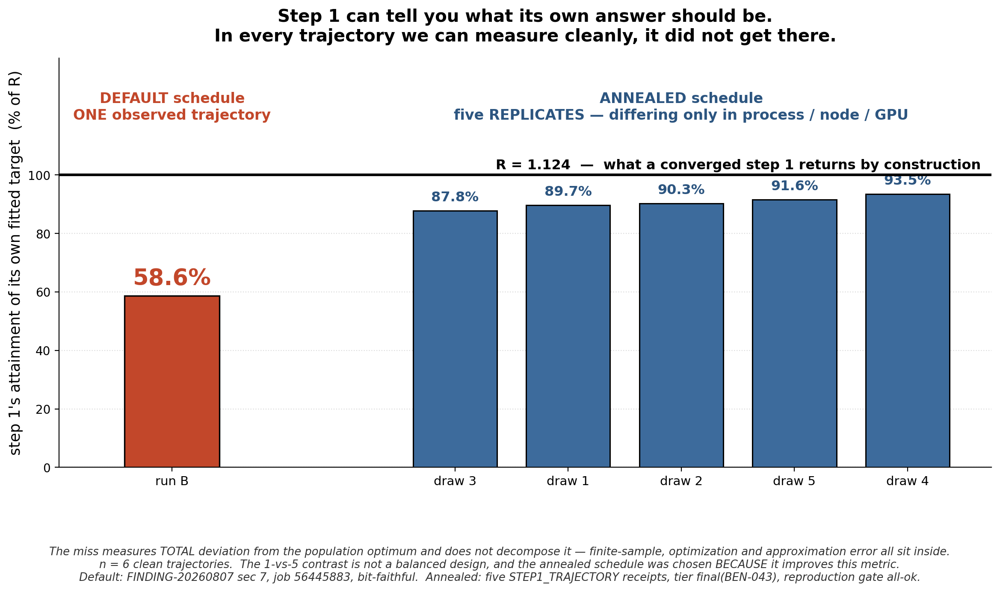
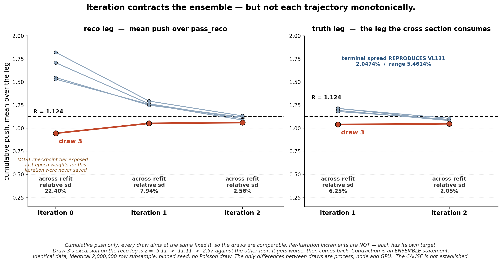

# Sept 9, 2026 — Nachman ML group

**Category:** technical challenge / methods result I want feedback on
**Budget:** < 20 min content. 8 slides, ~15:40 spoken, ~4 min questions. ~10 in the room, ~5 on Zoom.

> **Thesis:** OmniFold's step 1 hands you a closed-form target it must hit if it converges.
> Ours never got there — in any trajectory we can measure cleanly. Annealing narrows most
> of the miss; iteration damps some of the run-to-run variation that remains; a residual
> survives into the estimator. **The talk is about what lives in that gap.**
>
> Framing: OmniFold is Andreassen, Komiske, Metodiev, **Nachman**, Thaler (PRL 124, 2020)
> and PET is the OmniLearn backbone (Mikuni & **Nachman**, 2024). Both the method and the
> architecture are the group's — say "your," it's accurate, and it makes the ask *help me
> use your tools better* rather than a status report.
>
> **Emotional arc:** surprise (it misses a target it knows) → trust (we proved it's the
> same saved model) → hope (annealing and iteration help) → productive discomfort (help is
> not a definition of better). Any slide that moves none of those gets cut.

**The sentence they should repeat at lunch:**
> **Step 1 can tell you what its own answer should be — so check whether it got there.**

---

## Slide 1 — "OmniFold's step 1 tells you what its own answer should be."

**Visual:** the loop in three boxes — data vs. MC reco → classifier → weights — with the
loader's two class totals (`1e6`, `1e6·R`) drawn onto the classifier's inputs.

- Step 1 trains a classifier to separate data from simulation at reco level; the learned
  likelihood ratio becomes a per-event weight. Step 2 pulls it back to truth through the
  simulation's truth–reco pairing.
- The loader normalizes the MC side to `1e6` and the data side to `1e6·R`.
- **The identity, said once, carefully:** *if the fitted classifier attained the population
  minimizer of the weighted cross-entropy it is actually trained on, then averaging its
  implied likelihood ratio over the MC leg — under the same weights used in training —
  returns exactly the ratio of the two class totals.* That is `R = 1.124`.
- MINERvA in one breath: a neutrino scattering measurement; **nothing after this slide
  depends on that.**

*(1:45. Do not recite validation numbers. The only job is to hand them the target.)*

**Transition:** "So we have something unusual — a target the method itself tells us we must
hit. Let's see whether we did."

---

## Slide 2 — "It doesn't get there."  ⭐ CORE SLIDE

**Figure:** `step1_attainment.png` — full width.



- Target line at `R`. **One bar**, at **58.6%**. Hold it there. Then build in the five.
- Default schedule, **one observed trajectory**: `pull_final` mean over `pass_reco` =
  `0.658944` against `R = 1.124080`.
- Annealed schedule, **five replicates**: 87.8% – 93.5%.
- **What the miss measures:** total deviation from the population optimum. It does **not**
  decompose — finite-sample gap, optimization gap and approximation error all sit inside it.

*(2:30. The default bar must be alone on screen long enough that the n=1 scope is
unmistakable before anything joins it. Say both caveats out loud: the contrast is 1-vs-5,
not a balanced design; and the annealed schedule was chosen* because *it improves this
metric, so it is not independent evidence.)*

**Transition:** "Before I interpret a single number of that, I have to answer the question
I'd be asking: is that the optimizer, or did you analyze the wrong model?"

---

## Slide 3 — "Checkpoint selection is estimator selection."

**Visual:** four boxes, built live.

```
best-validation epoch → saved checkpoint → reloaded inference → recorded push
                              ↑
                      HISTORICAL DIVERGENCE
        training ended on the LAST epoch, held only in memory;
        the file kept the BEST epoch.  Two different networks.
        aggregate: agree to 1e-4      per event: differ by up to 87%

                      WHAT THE CLEAN RUN ESTABLISHED
        reloaded inference reproduces the recorded push
        to all printed digits.  Same network, start to finish.
```

- Mechanism, and it is three of the most common lines in Keras: `save_best_only=True`,
  `EarlyStopping(patience=10)`, `epochs=8`. Patience exceeds the budget, so best-weight
  restoration never fires. In-memory model is last-epoch; the file is best-epoch.
- **Why it isn't software hygiene:** in OmniFold the learned classifier *is* the estimator.
  There is no separate result downstream of it. So "which epoch is the model" is *which
  estimator you published* — and the two candidates pass identical aggregate validation
  while assigning materially different weights to individual events.

> ⚠️ **The 87% is measured on the step-2 push**, because that is what the reproduction gate
> compared. The `.pkl` histories show best ≠ last for the step-1 checkpoints too, so the
> phenomenon is there — but **do not say "the step-1 classifier moves by 87%."** Say "the
> saved classifier," or quote it on step 2 explicitly.

*(0:55. Hard cap. No filenames, no job IDs, no gate vocabulary on the slide.)*

**Transition:** "That's why the number on the last slide is the run's own. Now — what could
explain it?"

---

## Slide 4 — "What it isn't."

**Visual:** the claim ladder, three visibly different levels, OPEN deliberately the longest.

> **MEASURED.** In every trajectory we can measure cleanly — six of them — step 1 falls
> short of its own fitted target. One default-schedule trajectory at 58.6%; five annealed
> replicates at 87.8–93.5%. Annealing narrows the miss.
>
> **EXCLUDED HERE** — these four, on these trajectories, and nothing broader.
> • **Logit cap** — `cap_saturation_frac = 0.0`; implied logits span [−3.141, +1.366]
>   against a ±30 cap. Nothing is near it.
> • **Train/val split bias** — the index shuffle precedes the positional `take`/`skip`.
>   Verified in code, not asserted.
> • **Input representation** — we swapped a point-cloud transformer for boosted trees on
>   five hand-picked scalars, and the answer barely moved: 4D unfolded shapes agree to
>   **2.3–3.9% median per-bin**; MLP vs GBDT total ratio **1.0078**.
> • **Step 2** — undershoots its own target by **0.44%**. It is doing its job.
>
> **OPEN — why the residual gap remains.** Training budget: **no epoch ladder has ever been
> run against this quantity.** Early-stopping / checkpoint-selection interaction.
> Class-weight and finite-sample implementation. Approximation error at fixed capacity.
> The `pass_reco`-only update × acceptance interaction.

- Worth one sentence, as a pointer and not a conclusion: the implied logits reach −3.14
  downward but only +1.37 upward. Since `push = exp(logit)`, **the learned ratio is far
  more willing to suppress than to enhance.**

*(2:00. Representation is ONE ROW here. It was a whole act in the previous version of this
talk and it did not earn one — it is a control, and controls belong with the controls.)*

**Transition:** "One thing did move it, and it wasn't a modelling choice at all."

---

## Slide 5 — "Annealing narrows the shortfall — most of it, not all."

**Visual:** two-row evidence card. Shape recovery is a **caution badge**, not a third row
of decimals.

| | **DEFAULT (full-LR)** | **ANNEALED** |
|---|---|---|
| **closure deviation** | `\|dev\|` **34.46%** | `\|dev\|` **1.17%** |
| **step-1 attainment** | **58.6%** of R *(one trajectory, bit-faithful)* | **87.8–93.5%** of R *(five replicates)* |
| ⚠️ *shape-recovery check* | *0.546853 = 88.5% of the reference ceiling* | *0.512603 = 82.9%; passes its predeclared bar by +0.018* |

- **Two rows, never merged.** `34.5% → 1.2%` is the closure fold-forward deviation.
  `58.6% → 87.8–93.5%` is step 1's own attainment. Both improve; they are different
  quantities, and quoting only "1.2%" would let the room think the gap closed.
- **Wording on the slide is "narrows."** Never "repairs," never "fixes."
- **Say the confession out loud:** "we chose this schedule because it fixes this number, so
  I can't offer it as independent evidence."
- Recovery, in five seconds: `recovery = 1 − residual/gap`. *We inject a known shape
  distortion, unfold, and ask what fraction we got back. One is perfect. Higher is better.*
- The badge's real content: **the original bar was `recovery ≥ 0.80`, and the
  acceptance-limited ceiling is `0.618228` — no estimator could have reached it.** Of the
  0.2531 shortfall, **71.8% is specification and 28.2% is the estimator.**

*(2:30.)*

**Transition:** "That's one fit. We ran five more that differ only in which GPU they landed
on."

---

## Slide 6 — "Iteration contracts the ensemble — but not each trajectory monotonically."

**Figure:** `loop_trajectories.png` — full width.



- Identical data, identical 2,000,000-row subsample, pinned seed, **no Poisson draw**. The
  only differences between draws are **process, node and GPU**.
- **Truth leg** — the leg the cross section consumes: across-refit relative sd
  **6.25% → 2.05%**. That terminal value reproduces `VL131` to all printed digits
  (2.0474% / range 5.4614%).
- **Reco leg**: 22.40% → 7.94% → 2.56%.
- **Draw 3 gets worse before it comes back**: z = −5.11 → −11.11 → −2.57 against the other
  four. Contraction is an **ensemble** statement, not a per-fit law.

> ⚠️ **Cumulative push only.** Every draw aims at the same fixed `R`, so draws are
> comparable. **Per-iteration increments are not** — each has its own target, and a plot
> built from them invites the audience to infer a monotone correction that is not there.
> The words "expels," "diverges" and "converges" do not appear on this slide.

> ⚠️ **Checkpoint-tier exposure is graded, and the figure marks it.** Iteration 0 is the
> *most* exposed — `iter0_step1` is `BEST_IS_LAST=False` in 5/5 with val-loss gaps up to
> 6.4%, and those last-epoch weights were never written to disk, so no job can recover
> them. Iteration 1 is mildly exposed (gaps 0.06–0.11%). Iteration 2 is clean. **So the
> dramatic 22% is the number least entitled to be dramatic.** Say so.

**Answer the hostile question here, not in Q&A** — *"if the spread falls from 22% to 2%,
isn't OmniFold doing exactly what it should?"*:

> Yes, and I'm reporting that as a result. The loop stabilizes. But "the loop is
> stabilizing" and "the endpoint is stable enough" are different questions, and only the
> second depends on what you're doing with the answer. What's unusual about this 2% is what
> is *not* in it: identical data, identical subsample, pinned seed, no Poisson draw. **It
> isn't a statistical uncertainty — it's a floor on how well the analysis reproduces its own
> answer from its own inputs.** I'm not claiming 2% is universally unacceptable. I'm
> claiming it's a number you should know, and almost nobody measures it, because measuring
> it means deliberately re-running an identical fit five times.

*(2:30.)*

**Transition:** "So annealing helps and iteration helps. But look at what 'helps' cost us."

---

## Slide 7 — "'Better trained' isn't one thing here."

**Visual:** two objectives, arrows pointing opposite ways — normalization attainment
improving; the shape check not licensing the same conclusion; its reference marked
defective.

- **Say:** *Annealing removes most of the normalization shortfall. The available shape check
  does not license calling the estimator better overall — and its comparison baseline is
  confounded in a specific, named way.*
- **Never say:** *Annealing fixes convergence at the cost of shape.*
- The confound, in plain English: the configuration behind `0.546853` is **shown** to carry
  a sign-inverting iteration defect — its fold-forward inverts at iterations 1 and 2 and
  degrades 0.972 → 0.861 → 0.655, while the annealed arm never inverts. **But that does not
  mean the baseline is inflated:** the job that found the defect measured *sign*, not
  recovery. "Tail collapse inflates recovery" is a mechanism argument, not a measurement.
  **The direction of the confound is unknown.**
- The line to put on the slide, which is the strongest thing that is true:
  > **A defective configuration's number is a poor reference standard.**
- The ±0.02 comparison band was a declared **assumption** scaled from a GPU floor, not a
  measurement. The ceiling is a **reference curve, not a proven bound.**

*(2:00. This is where the talk stops being a fix story. Let it be uncomfortable.)*

**Transition:** "Which leaves me with one ask and one real question."

---

## Slide 8 — "Three checks, one question."

**The ask — concrete, and this group can actually answer it:**

> Should these become standard OmniFold validation?
> 1. **Target attainment** — does step 1 reach the `R` its own loader normalization implies?
> 2. **Checkpoint identity** — does reloaded inference reproduce the weights the run recorded?
> 3. **Fixed-input refits** — what is your reproducibility floor at identical data and a
>    pinned seed?
>
> All three are cheap. The third costs N identical re-runs, which every project's compute
> budget treats as waste.

**The question:**

> **When two validation objectives disagree, what decides?** We have one that improved and
> one that didn't, and no principled way to rank them.

*(1:30, then stop talking. Two questions. Not three, not five. If it's quiet, push the
third check — it needs zero neutrino context and everyone in that room has hit it.)*

---

## KNOWN WEAKNESSES — have the answer ready, don't wait to be caught

Ranked by how likely they are to hurt.

1. **The 87% is a step-2 number.** See the slide-3 warning. This is the one most likely to
   be a *factual* error from the podium.
2. **We never explain the miss.** OPEN is longer than EXCLUDED, deliberately. The budget
   ladder that would answer it has never been run against this quantity.
3. **The dose-response is 1-vs-5, not a balanced design.** Six clean trajectories, exactly
   one clean default-schedule measurement, and the other five are near-replicates.
4. **The anneal was selected on the metric it improves.** Conceded on slide 5. The fix
   cannot be offered as discovery.
5. **The shape baseline is confounded in an unknown direction.** Slide 7's discomfort rests
   partly on a comparison we cannot clean up.
6. **One dataset, one architecture, one `R`.** Nothing about OmniFold generally is earned.
   *"Does this happen in the original OmniFold papers?"* has no answer from us.
7. **Zero event-level or phase-space evidence.** *"Where does step 1 under-deliver?"* —
   unknown. Everything here is an aggregate mean over the whole sample. The inference job
   that would answer it is costed (~1–3 A100-h, one job) and has not run.

---

## GUARDRAILS — do not cross these on the day

Live constraints in the repo, not stylistic preference.

- Never call `C_stat` "verified", "adopted", or "the statistical uncertainty."
- Never cite "bootstrap-centering" as a settled mechanism. The phrase *is* in Joseph's
  ruling text, so a faithful quotation isn't an error — but the mechanism is **not
  established** and must never be presented as a determined cause.
- **Never name a cause for the re-fit spread.** Measured that it happens; unestablished why.
- **Never present non-convergence as established.** It is the *leading candidate* in the
  repo's own words, and slide 4's OPEN column is where it lives. "Insufficient optimization"
  and "estimator dependence on an intentional hyperparameter" are not rival hypotheses at
  the level of description we can support — only the *directionality* of the movement tips
  it, and that is suggestive, not exclusion.
- Show **no** 3D or N-D covariance band, and no σ or χ² derived from one. That rules out the
  July deck's `+3.9σ` / `+2.3σ` and the grey bands in `generators_vs_unfolded_band.png` and
  `compare_mec_eavail.png` (both draw from `hCov_combined3d_total`).
- Covariance gets **at most one spoken sentence** if asked. It is not a slide.
- PET is **diagnostic / method-development**, in the talk exactly as in the note.
- Both figures **re-plot committed records**; they do not re-measure. Said in every
  docstring and every caption, and each script prints a reproduction check.

## Practical

- Figures are 200 dpi, ~2300–2650 px wide — legible projected and after Zoom re-compression.
- Regenerate (from the repo root):
  ```
  P=/global/u2/j/josephrb/.conda/envs/root_6_28/bin/python
  $P docs/sep-09-presentation/make_attainment_figure.py     # step1_attainment.png
  $P docs/sep-09-presentation/make_trajectory_figure.py     # loop_trajectories.png
  ```
  The login node's default `python3` has no matplotlib.
- Each script prints a self-check: the attainment script re-derives 58.62% and 87.83–93.52%
  from the transcribed records; the trajectory script re-derives the reco-leg spreads
  22.402 / 7.939 / 2.560 and the truth-leg 6.245 / 2.047, the last of which reproduces
  `VL131`'s recorded 2.0474045%.
- Sources: `FINDING-20260807-step1-under-achieves.md` (§5, §7),
  `FINDING-20260807-checkpoint-is-not-the-trained-model.md`, `CLAIM-CLM-012.md` (viii),
  `VALIDATION_LEDGER.md` (VL94–VL97, VL100–VL101, VL130–VL132), and the per-draw
  `STEP1_TRAJECTORY` / `STEP1_DECOMPOSITION` receipts. If any are re-measured, update the
  script tables and captions together.

## BACKUP — cut from the spine, keep in the folder

- `refit_spread.png` — the VL131 endpoint on its own. Superseded as a spine slide by
  `loop_trajectories.png`, which shows the same endpoint *and* how it got there. Good backup
  if someone wants the endpoint without the trajectory.
- `pet_bootstrap_anomaly.png` — **cut to backup on Joseph's call.** Visually the best figure
  in the folder, but it belongs to a different talk: it is about spatial structure in a
  bootstrap family, not about step 1's attainment of its own objective. Nothing in the
  current arc depends on it.
- `cstat_variance_budget.png` — covariance budget. Only if directly asked, and then one
  sentence.
