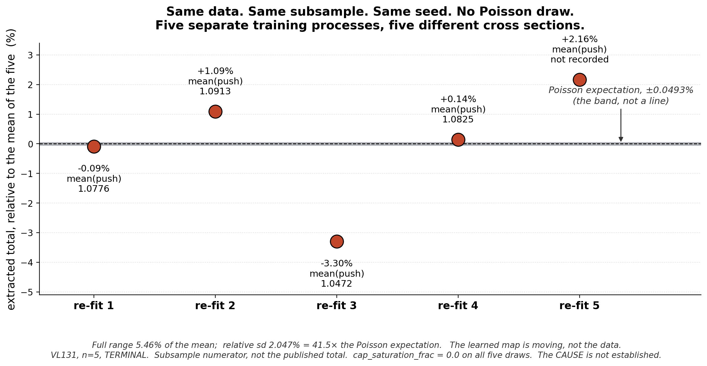

# Sept 9, 2026 — Nachman ML group

**Category:** technical challenge / methods result I want feedback on
**Budget:** < 20 min content. 8 slides, ~18 min. ~10 in the room, ~5 on Zoom.

> **Thesis:** two probes of the OmniFold step-1 classifier, both surprising.
> Change the input representation and nothing happens. Change *nothing* and the
> learned map moves enough to shift the cross section by 2%. **The step-1 solution
> is not unique in practice, and representational capacity is not the bottleneck.**
>
> The uncertainty consequence is real but it is **slide 7, one line** — the group
> would rather talk about methods than covariance bookkeeping, and the methods
> statement is the stronger one anyway.
>
> Framing note: OmniFold is Andreassen, Komiske, Metodiev, **Nachman**, Thaler
> (PRL 124, 2020) and PET is the OmniLearn backbone (Mikuni & **Nachman**, 2024).
> Both the method and the architecture are the group's — say "your," it's accurate,
> and it makes the ask *help me use your tools better* rather than a status report.

---

## Slide 1 — Title

**Two things about the OmniFold step-1 classifier that surprised me**

Sub-line: the input representation doesn't matter. Re-running the same fit does.

*(~20 s. The title is the claim; don't preamble it.)*

---

## Slide 2 — What MINERvA is, in one breath

- νμ charged-current **inclusive** scattering on hydrocarbon, ⟨Eν⟩ ≈ 6 GeV, NuMI beam.
- We measure a cross section differentially in muon kinematics (pT, p∥) — and, in the
  higher-dimensional extensions, in hadronic-recoil variables too.
- Two things make it hard, both relevant here: detector response is broad enough that
  **unfolding is unavoidable**, and the "truth" we unfold to comes from an event generator
  we know is wrong in places — which is much of why we're measuring.
- Anchor so you trust the pipeline: unbinned OmniFold reproduces the published 2D result,
  total σ **3.073e-38 cm²/nucleon** (1.11% high), median per-bin uncertainty **6.87%** vs
  published **6.86%**.

*(~90 s. No beamline, no detector diagram. The anchor is one sentence — its only job is to
buy you the right to show something broken later.)*

---

## Slide 3 — The object of study

Frame the classifier as the thing under the microscope, not the physics.

- OmniFold step 1: train a classifier to separate data from simulation at reco level; the
  learned likelihood ratio becomes a per-event weight. Step 2 pulls it back to truth
  through the simulation's truth–reco pairing.
- **In theory the step-1 target is unique** — it's a density ratio, and the population
  minimizer is the same function no matter how you parameterize it.
- **In practice you get whatever the optimizer landed on**, and the physics depends on that
  function through a weighted sum over ~2M events.
- So two obvious questions, and I have an answer to both:
  - **(A)** does the *input representation* change the learned function?
  - **(B)** does *re-running the identical fit* change it?

*(~90 s. This slide is the spine of the talk — it converts everything after it from
"neutrino bookkeeping" into "properties of an estimator." Note honestly that A and B were
originally separate investigations, not a designed two-arm experiment; you're presenting
them together because they probe the same object.)*

---

## Slide 4 — (A) Change the representation: nothing happens

- Production estimator: **GBDT on 5 event-level scalars**.
- Swap the step-1 classifier for **PET**, the point-cloud backbone from **OmniLearn**
  (Mikuni & Nachman, arXiv:2404.16091): raw non-muon **recoil clusters** at reco level,
  truth final-state hadrons at truth level.
- The muon is measured from the MINERvA–MINOS track and stored as event-level scalars —
  it enters selection and binning but is **omitted from both classifiers**, so the learned
  weight is a function of recoil information only.
- **Result: 4D unfolded shapes agree to 2.3–3.9% median per-bin.** Independently, MLP vs
  GBDT on the scalar side gives a total ratio of **1.0078** and median projection
  differences of **1.20% / 1.36% / 0.66%** in pT / p∥ / E_avail.

**Methods conclusion:** for this measurement, representational capacity is not the
binding constraint. A point-cloud transformer on low-level detector output and five
hand-picked scalars land in the same place.

Optional figure: `nd-unfolding/products/pet/pet_vs_gbdt.png`. State the limits rather than
hiding them: shape-only, area-normalized, PET on a 2M-event subsample; the wide `q3` catch
bin is a binning artifact. It's a representation cross-check, not an independent result.

*(~2.5 min. Sell it as a genuine negative result — those are useful and this room will
take it seriously. Then pivot: "so I re-ran the thing to check stability, and that's where
the talk starts.")*

---

## Slide 5 — (B) Change nothing: the map moves  ⭐ CORE SLIDE

**Figure:** `refit_spread.png` — full width.



- Identical data. Identical 2,000,000-row subsample. `set_random_seed(42)`. **No Poisson
  draw.** Five separate training processes.
- The extracted total spans **5.46%**; relative sd **2.047%**.
- Poisson expectation on 4,116,128 events: **0.0493%** — the hairline band, not a line.
  So this is **41.5×** the statistical noise floor with **nothing resampled**.
- It's the learned function moving, visible one level down in `mean(push)` per re-fit:
  **1.0776 / 1.0913 / 1.0472 / 1.0825** — a ~4% spread in the *mean weight itself*.
- Negative control: `cap_saturation_frac = 0.0` on every draw, so it is not a
  logit-clipping artifact.

**Methods conclusion:** the step-1 solution is not unique in practice. Whatever the
population minimizer is, five runs found five different functions, and the difference is
large where it matters.

*(~4–5 min. This is the slide. Carry VL131's caveats out loud: subsample numerator rather
than the published full-inventory total, and n=5. Both are on the figure.)*

> ⚠️ **Do not name a cause.** That separate processes disagree is **measured**. *Why* is
> **not established** — GPU atomics, threading, library nondeterminism are all unverified
> here. Naming one from the podium turns your best open question into a claim you can't
> support, and it is the single likeliest question from the floor. Have ready:
> *"I don't know yet — that's part of what I'm asking."*

---

## Slide 6 — The movement is structured, not noise

**Figure:** `pet_bootstrap_anomaly.png` — full width.


Comparing the nominal fit against a 50-member bootstrap family, the disagreement is
**organized in p∥ with a sign flip**:

- Below 6 GeV the ensemble behaves — median z = −0.13, 4 of 128 cells outside the full
  50-draw range. This is what "fine" looks like.
- In the 63-cell **6–20 GeV** band the nominal exceeds **all fifty** replicas in 44 of 63
  cells, median **1.21×** the largest of the fifty draws; in *every* one of the 63, at
  least 45 of 50 members lie below it.
- Above 20 GeV the sign **reverses**: 44 of 45 cells with the nominal below the family mean.
- The nominal's integral sits at the **98th percentile** of the 50 member totals.

**Methods conclusion:** this isn't white noise on a converged answer. It's a systematic
tilt in the learned function, localized in a kinematic variable that neither classifier
sees directly. That's the strongest hint I have about what the extra variance *is*.

*(~3 min. The three bands use three different recorded statistics and don't partition the
257 quotable cells — 236 shown. It's on the figure; say it once.)*

---

## Slide 7 — What it cost me

Keep this short. It's consequence, not thesis.

- If re-fitting moves the answer by 41× Poisson, a bootstrap family isn't measuring the
  data — the family spread is **5.167%**, ~**105×** Poisson, and the fixed-seed floor is
  **15.70%** of that *variance*.
- Three candidate explanations were on the table; each was refuted by measurement. So
  rather than pick the least-bad one I **declined the central/statistical pairing** and
  demoted the result to diagnostic / method-development. No PET covariance is adopted.
- Reconsideration needs estimator-equivalence **and coverage** — and coverage is a
  different object from checking the matrix was assembled correctly.

Backup figure if anyone pushes: `cstat_variance_budget.png` (Poisson / fixed-seed floor /
full family, log scale).

*(~1.5 min. Do not re-litigate the covariance. If the room wants that conversation they'll
ask, and you have the backup slide.)*

---

## Slide 8 — What I want from you

1. **Is 2% at fixed seed normal?** Same data, same seed, separate processes, 2% apart on a
   physics total. Do you design this out — and how — or budget for it?
2. **Would you ensemble the classifier?** If the step-1 solution isn't unique, is the right
   estimator the *average* over re-fits rather than one fit? What breaks if I do that
   inside an iterative procedure?
3. **Is the sign flip a known signature?** Coherent tilt in p∥ reversing sign — support /
   extrapolation boundary, optimizer path dependence, something about the pull-back step?
4. **The uncomfortable one.** If re-fit variance is generically this large, does
   bootstrap ⊕ systematics double-count, or miss a cross term, for *every* OmniFold
   analysis that quotes one?
5. **Representation.** Given (A), is the real bottleneck the truth-side prior rather than
   the classifier's input? That would reorder what's worth building next.

*(~3 min, then stop talking. If it's quiet, push #1 — it needs zero neutrino context and
everyone in that room has hit it.)*

---

## GUARDRAILS — do not cross these on the day

Live constraints in the repo, not stylistic preference.

- Never call `C_stat` "verified", "adopted", or "the statistical uncertainty."
- Never cite "bootstrap-centering" as a settled mechanism. The phrase *is* in Joseph's
  ruling text, so a faithful quotation isn't an error — but the mechanism is **not
  established** and must never be presented as a determined cause. Operative wording:
  *a large, spatially coherent anomaly whose coverage has not been validated.*
- Never name a cause for the re-fit spread. Measured that it happens; unestablished why.
- The ruling does **not** find the nominal wrong or the dispersion invalid. It says
  neither. The missing evidence is coverage.
- Show **no** 3D or N-D covariance band, and no σ or χ² derived from one. The historical 3D
  covariance and its generator significances are quarantined — that rules out the July
  deck's `+3.9σ` / `+2.3σ` and the grey bands in `generators_vs_unfolded_band.png` and
  `compare_mec_eavail.png` (both draw from `hCov_combined3d_total`).
- PET is **diagnostic / method-development**, in the talk exactly as in the note.
- All three figures **re-plot committed records**; they do not re-measure. Said in every
  docstring and every caption.

## Practical

- Figures are 200 dpi, ~2300 px wide — legible projected and after Zoom re-compression.
- Regenerate:
  ```
  P=/global/u2/j/josephrb/.conda/envs/root_6_28/bin/python
  $P docs/sep-09-presentation/make_refit_figure.py
  $P docs/sep-09-presentation/make_anomaly_figure.py
  $P docs/sep-09-presentation/make_variance_figure.py
  ```
  The login node's default `python3` has no matplotlib.
- `make_refit_figure.py` derives range 5.461% and sd 2.047% from the five transcribed
  totals, reproducing VL131's recorded values — a check that the transcription is right.
- Numbers come from `VALIDATION_LEDGER.md` (VL131, VL132) and `docs/OPEN_ITEMS.md`
  (OI-126). If any are re-measured, update the script tables and captions together.
