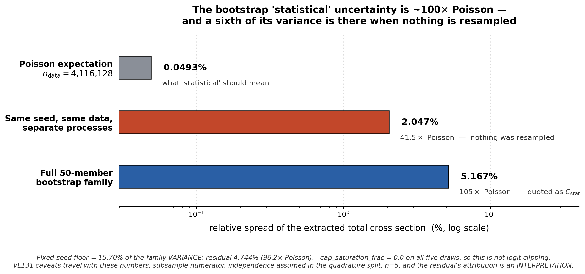

# Sept 9, 2026 — Nachman ML group

**Category:** technical challenge / result I want feedback on
**Budget:** < 20 min content. 8 slides, ~18 min. ~10 in the room, ~5 on Zoom.

> **Thesis, in one line:** the bootstrap "statistical" uncertainty on an iterative
> ML unfold is ~100× the Poisson scale, and a sixth of its variance is present when
> nothing is resampled at all. Re-running the fit — not the data — is doing the work.
>
> This is **not** "I was careful and demoted a result." The demotion is a one-line
> consequence on slide 7. The finding is that a form of run-to-run irreproducibility
> everyone tolerates during training becomes 40× the statistical error once you unfold
> with it.
>
> Framing note: OmniFold is Andreassen, Komiske, Metodiev, **Nachman**, Thaler
> (PRL 124, 2020) and PET is the OmniLearn backbone (Mikuni & **Nachman**, 2024).
> Both the method and the architecture are the group's — say "your," it's accurate,
> and it makes the ask *help me use your tools better* rather than a status report.

---

## Slide 1 — Title

**Your unfolding method has a reproducibility floor 40× larger than its statistical error. I found it the hard way.**

Sub-line: unbinned OmniFold on MINERvA neutrino data — a point-cloud cross-check that
worked, and an uncertainty that didn't.

*(~20 s. Don't editorialize; the title is the claim.)*

---

## Slide 2 — What MINERvA is, in one breath

- νμ charged-current **inclusive** scattering on hydrocarbon, ⟨Eν⟩ ≈ 6 GeV, NuMI beam.
- We measure a cross section differentially in muon kinematics (pT, p∥).
- Two things make it hard, both relevant to this room: detector response is broad enough
  that **unfolding is unavoidable**, and the "truth" we unfold to comes from an event
  generator we know is wrong in places — which is much of why we're measuring.

*(~90 s. Do not teach the beamline. No detector diagram.)*

---

## Slide 3 — The anchor: this part works

- Unbinned OmniFold reproduces the published MINERvA 2D result:
  total σ **3.073e-38 cm²/nucleon**, 1.11% above the paper total.
- Independently reconstructed uncertainty budget: median per-bin **6.87%** vs published
  **6.86%**. Closure, completeness and iteration controls all pass.
- **This is the validated part of the analysis and it is not what the talk is about.**
  It's here so you know the pipeline works before I show you something broken.

*(~60 s. Resist expanding. Its only job is credibility.)*

---

## Slide 4 — The question I actually asked: does the representation matter?

- Production estimator: **GBDT on 5 event-level scalars**.
- Swap the step-1 classifier for **PET**, the point-cloud backbone from **OmniLearn**
  (Mikuni & Nachman, arXiv:2404.16091): raw non-muon **recoil clusters** at reco level,
  truth final-state hadrons at truth level.
- The muon is measured from the MINERvA–MINOS track and stored as event-level scalars. It
  enters selection and binning but is **omitted from both classifiers** — so the learned
  weight is a function of recoil information only.
- **Answer: it doesn't matter.** 4D unfolded shapes agree to **2.3–3.9%** median per-bin.
  On the scalar side, MLP-vs-GBDT gives a total ratio of 1.0078 and median projection
  differences of 1.20% / 1.36% / 0.66% in pT / p∥ / E_avail.

Optional figure: `nd-unfolding/products/pet/pet_vs_gbdt.png`. Caveats to state, not hide:
shape-only, area-normalized, PET on a 2M-event subsample; the wide `q3` catch bin is a
binning artifact. It is a representation cross-check, not an independent physics result.

*(~2 min. Land it as a clean negative result: two very different input representations,
same answer. Low-level inputs bought nothing here. Then pivot — "so I went to price the
uncertainty, and that's where this talk starts.")*

---

## Slide 5 — The number that stopped me  ⭐ CORE SLIDE

**Figure:** `cstat_variance_budget.png` — full width.



- Identical data. Identical 2M-row subsample. `set_random_seed(42)`. **No Poisson draw.**
  Separate processes. → totals disagree by **2.047%**.
- Poisson expectation on 4,116,128 events: **0.0493%**. So this is **41.5×** the
  statistical noise floor, with **nothing resampled**.
- Mechanism is visible one level down — `mean(push)` per draw:
  **1.0776 / 1.0913 / 1.0472 / 1.0825**. The *learned map* is moving, not the data.
- Negative control: `cap_saturation_frac = 0.0` on all five draws, so it is not a
  logit-clipping artifact.
- Scale it up: the full 50-member bootstrap family spread is **5.167%** ≈ **105× Poisson**
  — and the fixed-seed floor accounts for only **15.70%** of that *variance*. Residual
  **4.744%** (96.2× Poisson).

**Say the honest version of the punchline:** I do not know what the remaining 84% is. What
I can say is that the object being quoted as a statistical uncertainty is two orders of
magnitude above the Poisson scale, and at least a sixth of it survives when you stop
resampling.

*(~4–5 min. This is the slide. Carry the VL131 caveats out loud: subsample numerator not
the published full-inventory total; the quadrature split assumes independence; n=5, so
each sd carries real fractional uncertainty; and attributing the residual to the map's
response to the Poisson draw is an **interpretation**, not a measurement.)*

> ⚠️ **Do not name a cause.** That separate processes disagree is measured. *Why* is not
> established — I have not shown it is GPU atomics, threading, library nondeterminism or
> anything else. Saying "probably GPU nondeterminism" from the podium converts an open
> question into a claim you can't support, and it's the most likely question from the room,
> so have "I don't know yet, that's part of what I'm asking" ready.

---

## Slide 6 — The spatial signature

**Figure:** `pet_bootstrap_anomaly.png` — full width.


- Below 6 GeV in p∥ the ensemble behaves: median z = −0.13, 4 of 128 cells outside the
  full 50-draw range. This is what "fine" looks like.
- In the 63-cell **6–20 GeV** band the nominal exceeds **all fifty** replicas in 44 of 63
  cells, median **1.21×** the largest of the fifty draws. In *every* one of the 63, at
  least 45 of 50 members lie below it.
- Above 20 GeV the sign **reverses**: 44 of 45 cells with the nominal below the family mean.
- The nominal's own integral sits at the **98th percentile** of the 50 member totals.

So the failure isn't diffuse noise — it's **organized in p∥ with a sign flip.** That's a
structure worth explaining, and it's the strongest hint I have about what the extra
variance is.

*(~3 min. Bands use three different recorded statistics and don't partition the 257
quotable cells — 236 shown. Say so; it's on the figure.)*

---

## Slide 7 — What I did about it

- Three candidate explanations were on the table. Each was refuted by measurement. So
  rather than pick the least-bad one, I **declined the central/statistical pairing** and
  demoted the result.
- The 50-member matrix exists and is documented. It is **not** independently verified,
  **not** paired with a central value, and **not** "the statistical uncertainty." Known
  shortfall: N=50 gives **10.1%** fractional uncertainty on every estimated sd.
- No PET covariance is adopted. The recoil-only track came out of the main paper and is now
  a prospective appendix.
- Reconsideration gate is estimator-equivalence **and coverage** — and coverage is a
  *different object* from checking the matrix was assembled correctly. Confirming the
  arithmetic measures nothing about whether an interval covers. Conflating those two is
  what I was doing for a while.

*(~1.5 min. Brief on purpose. This is consequence, not thesis.)*

---

## Slide 8 — What I want from you

1. **The floor.** Separate processes, same seed, same data, 2% apart on a physics total.
   Is that a number you recognize? Do you design it out, or budget for it?
2. **The structure.** Nominal outside its own bootstrap ensemble, coherent in p∥ with a
   sign flip — is that a signature of something known? Resampling response of the learned
   map, support/extrapolation, optimizer path dependence?
3. **Coverage.** How would you test coverage for an unbinned, iteratively-reweighted
   estimator when the bootstrap family is the only ensemble you have? The existing 2D toy
   ensemble does not give a valid independent-truth coverage test, and that's open.
4. **The uncomfortable one.** If re-fit variance is generically this large, does bootstrap
   ⊕ systematics double-count, or miss a cross term, for *every* OmniFold analysis that
   quotes one?

*(~3 min, then stop talking. If the room is quiet, push question 1 — it needs zero neutrino
context and every person there has hit it.)*

---

## GUARDRAILS — do not cross these on the day

Live constraints in the repo, not stylistic preference.

- Never call `C_stat` "verified", "adopted", or "the statistical uncertainty."
- Never cite "bootstrap-centering" as a settled mechanism. The phrase *is* in Joseph's
  ruling text, so a faithful quotation isn't an error — but the mechanism is **not
  established** and must never be presented as a determined cause. Operative wording:
  *a large, spatially coherent anomaly whose coverage has not been validated.*
- The ruling does **not** find the nominal wrong or the dispersion invalid. It says
  neither. The missing evidence is coverage.
- Show **no** 3D or N-D covariance band, and no σ or χ² derived from one. The historical 3D
  covariance and its generator significances are quarantined — that rules out the July
  deck's `+3.9σ` / `+2.3σ` and the grey bands in `generators_vs_unfolded_band.png` and
  `compare_mec_eavail.png` (both draw from `hCov_combined3d_total`).
- PET is **diagnostic / method-development**, in the talk exactly as in the note.
- Central-value ratios are fine: the 46%-of-gap and 27%-of-integrated-deficit 2p2h numbers
  are ratios of central values, not covariance-dependent.
- Both figures **re-plot committed records**; they do not re-measure. Said in both
  docstrings and both captions.

## Practical

- Figures are 200 dpi, ~2400 px wide — legible projected and after Zoom re-compression.
- Regenerate:
  ```
  P=/global/u2/j/josephrb/.conda/envs/root_6_28/bin/python
  $P docs/sep-09-presentation/make_variance_figure.py
  $P docs/sep-09-presentation/make_anomaly_figure.py
  ```
  The login node's default `python3` has no matplotlib.
- Figure numbers are transcribed from `VALIDATION_LEDGER.md` (VL131, VL132) and
  `docs/OPEN_ITEMS.md` (OI-126). If any are re-measured, update the script tables and the
  captions together.
