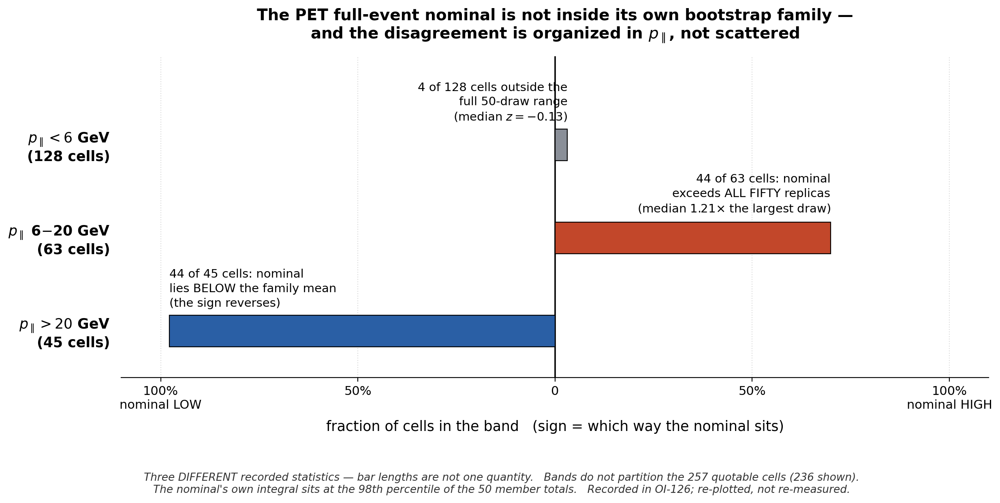

# Sept 9, 2026 — Nachman ML group

**Category:** technical challenge / result I'd like feedback on
**Budget:** < 20 min content. One slide + the figure. ~10 in the room, ~5 on Zoom.

---

## THE SLIDE

### Title
**I ran your point-cloud transformer on neutrino data. The two representations agreed — and I still declined the result.**

> Framing note: OmniFold is Andreassen, Komiske, Metodiev, **Nachman**, Thaler (PRL 124, 2020)
> and PET is the OmniLearn backbone (Mikuni & **Nachman**, 2024). Both the method and the
> architecture are the group's. Say "your" deliberately — it is accurate, and it sets up the
> ask as *help me use your tools better*, not a status report.

### Figure
`pet_bootstrap_anomaly.png` (this directory) — full width, upper two-thirds.

> Note: this is the **only tracked `.png` in the repo** — `.gitignore:4` excludes `*.png`
> repo-wide and all 55 note figures are PDF. It is force-added so the figure renders on
> GitHub for review. It is a talk asset, not a note figure and not evidence; nothing in any
> build closure consumes it, and `make_anomaly_figure.py` regenerates it.

Optional second panel if you want the agreement shown rather than asserted:
`nd-unfolding/products/pet/pet_vs_gbdt.png`. Caveat: its axis labels are raw
(`pt`, `eavail`) and the `q3` panel is dominated by a wide catch bin. If you use it,
say the catch bin is a binning artifact — it is called out as such in the note.

### Bullets (keep to these six lines on the slide itself)

- **Setup.** MINERvA: νμ charged-current inclusive scattering on hydrocarbon, ⟨Eν⟩ ≈ 6 GeV.
  OmniFold, unbinned, GBDT baseline on 5 event-level scalars.
- **The cross-check.** Swap the step-1 classifier for **PET**, the point-cloud backbone
  introduced in **OmniLearn** (Mikuni & Nachman, arXiv:2404.16091): raw non-muon
  **recoil clusters** at reco level,
  truth final-state hadrons at truth level. Muon in selection and binning, **not** in
  either classifier.
- **It worked.** 4D unfolded shapes agree with the scalar GBDT to **2.3–3.9%** median
  per-bin. Absolutely normalized central value and ordinary closure both pass.
- **Then the uncertainty.** The nominal is **not inside its own 50-member bootstrap
  family**, and the disagreement is *organized in p∥*, with a sign reversal → figure.
- **And a floor I can't explain.** Identical data, identical subsample, `set_random_seed(42)`,
  **no** Poisson draw, separate processes: totals disagree by **2.05%** = **41.5×** the
  Poisson prediction. That accounts for only ~16% of the family variance.
- **The call.** Declined the central/statistical pairing; PET is demoted to
  diagnostic / method-development. No PET covariance is adopted. Reconsideration needs
  estimator-equivalence **and coverage** — coverage being a different object from
  checking that the matrix was built correctly.

### The ask (say this out loud, it's the point of the talk)

1. Is "nominal sits outside its own bootstrap ensemble, coherently, with a spatial sign
   flip" a signature any of you recognize? Resampling response of the learned map,
   support/extrapolation, or optimization noise?
2. How would you test **coverage** for an unbinned, iteratively-reweighted estimator when
   the bootstrap family is the only ensemble you have?
3. Estimator nondeterminism at 41× the Poisson scale — how do people fold that into an
   uncertainty budget, or do they design it out?

---

## SPEAKER NOTES (~16 min)

### 0:00–2:30 — What MINERvA is, in one breath
They know particle physics but not neutrinos. Don't teach the beamline.

> "Neutrino beam hits a hydrocarbon target. We count charged-current interactions and
> measure the cross section differentially in muon kinematics. Two things make it hard
> and they're both relevant to you: the detector response is broad enough that unfolding
> is unavoidable, and the 'truth' we unfold to comes from an event generator that we know
> is wrong in places — that's a large part of why we're measuring."

Say the one number that anchors credibility, because it is the fully validated part:
the 2D reproduction of the published result matches at **6.87%** median per-bin
uncertainty against the published **6.86%**. Then move on — the 2D result is *not* this
talk.

### 2:30–5:00 — Why a point cloud at all
This is their architecture; give the motivation, not the sales pitch.

> "The production estimator hands the classifier five numbers per event. But the detector
> gives us a cluster-level picture of the hadronic recoil, and the truth side is already a
> point cloud — a list of final-state hadrons. Compressing that to five scalars is a
> choice, and I wanted to know whether the choice was doing any work."

Be precise about the muon, because someone will ask: the muon momentum and direction are
measured from the MINERvA–MINOS track and stored as event-level scalars. It enters
selection and downstream binning. It is **omitted from both classifiers**. So the learned
weight is a function of recoil information only. That is exactly why the full-event
estimator is a *separate* object needing its own nominal fit and an omitted-muon stress
closure.

### 5:00–7:00 — The agreement
Shapes agree to 2.3–3.9% median per-bin across four axes. Also worth one line: the
MLP-vs-GBDT cross-check on the scalar side gives a total ratio of 1.0078 and median
projection differences of 1.20% / 1.36% / 0.66% in pT / p∥ / E_avail.

**State the limits before anyone asks** — it costs nothing and buys the room:
shape-only, area-normalized, PET on a 2M-event subsample. It is a representation
cross-check, not an independent physics result.

Land the honest reading: *the agreement is the null result.* Two very different input
representations, same answer. Good news for the method, mildly disappointing if you
hoped low-level inputs would buy something.

### 7:00–11:30 — The figure, and why I stopped
This is the part you want feedback on. Walk the three bands left to right.

- Below 6 GeV in p∥ the ensemble behaves — median z = −0.13, 4 of 128 cells outside the
  full 50-draw range. This is what "fine" looks like.
- In the 63-cell 6–20 GeV band the nominal exceeds **all fifty** replicas in 44 of 63
  cells, median 1.21× the largest of the fifty draws. In *every* one of the 63, at least
  45 of 50 members lie below it.
- Above 20 GeV the sign **reverses**: 44 of 45 cells with the nominal below the family mean.
- The nominal's own integral sits at the **98th percentile** of the 50 member totals.

Then the nondeterminism floor, which is its own puzzle and the one most likely to get a
useful answer from this room: at identical data, identical 2M-row subsample, seed 42, and
no Poisson draw, separate processes disagree on the total by 2.05% — 41.5× the 0.0493%
Poisson prediction on 4.1M events. Negative control: cap-saturation fraction is 0.0 on
every draw, so it is not a logit-clipping artifact. It explains ~16% of the family
variance; ~4.7% remains.

**Say what this does and does not establish.** It does not establish that the nominal is
wrong, and it does not establish that the measured dispersion is invalid. What's missing
is coverage.

> ⚠️ **Do not attribute a mechanism.** Two candidate mechanisms were named during this
> work and the row's own measured history refutes both. Describe it as *a large, spatially
> coherent anomaly whose coverage has not been validated*. If you want to name suspects,
> name them as **suspects you have not established** — that's also the honest way to
> invite the room to propose better ones.

### 11:30–14:00 — The decision
The move that's worth their time is that the options were exhausted and none was taken:

> "Three explanations were on the table and each was refuted by measurement. So rather
> than pick the least-bad one, I declined the pairing and demoted the result. The 50-member
> matrix exists and is documented. It is *not* independently verified, it is *not* paired
> with a central value, and it is *not* 'the statistical uncertainty' — it's a constructed
> object with a known shortfall: N=50 gives 10.1% fractional uncertainty on every
> estimated standard deviation."

Consequences, concretely: no PET total covariance is adopted; the recoil-only track came
out of the main paper and is now a prospective appendix; the reconsideration gate is
estimator-equivalence **plus** coverage. Verifying that the matrix was assembled correctly
measures nothing about whether an interval covers — those are different objects, and
conflating them is what I was doing for a while.

### 14:00–16:00 — Ask, then get out of the way
Put up the three questions and stop talking. If the room is quiet, the nondeterminism
question is the one to push — it's self-contained and doesn't need any neutrino context.

---

## GUARDRAILS — do not cross these on the day

Every one of these is a live constraint in the repo, not stylistic preference.

- Do **not** call `C_stat` "verified", "adopted", or "the statistical uncertainty".
- Do **not** cite "bootstrap-centering" as a settled mechanism. Joseph's ruling text does
  contain that phrase, so a faithful quotation is not an error — but the mechanism is
  **not established**, and it must never be presented as a determined cause.
- Do **not** say the ruling found the nominal wrong or the dispersion invalid. It says
  neither. The missing evidence is coverage.
- Do **not** show a 3D or N-D covariance band or any σ / χ² derived from one. The
  historical 3D covariance and its generator significances are quarantined, which kills
  the `+3.9σ` / `+2.3σ` numbers from the July leave-behind deck and the grey bands in
  `generators_vs_unfolded_band.png` and `compare_mec_eavail.png` (both draw from
  `hCov_combined3d_total`).
- PET is **diagnostic / method-development**, in the talk exactly as in the note.
- Central-value ratios are fine: the 46%-of-gap and 27%-of-integrated-deficit 2p2h
  numbers are ratios of central values, not covariance-dependent.

## Practical

- Figure is 200 dpi, ~2470 px wide — fine projected and legible re-compressed for Zoom.
- Regenerate with:
  `/global/u2/j/josephrb/.conda/envs/root_6_28/bin/python docs/sep-09-presentation/make_anomaly_figure.py`
  (the default `python3` on the login node has no matplotlib).
- Numbers in the figure are transcribed from the committed OI-126 record. If you re-measure
  the family, update the script's `BANDS` table and the caption together.
